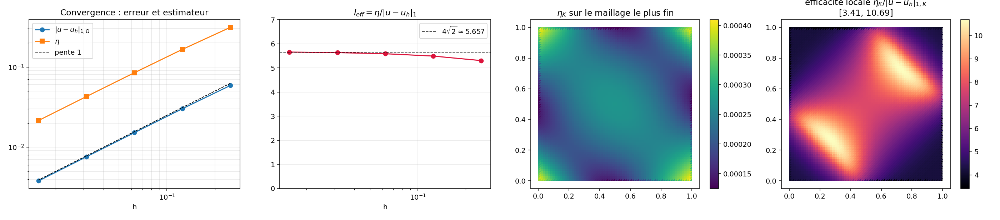

# Estimation d'erreur *a posteriori* par résidus — éléments finis P1

**Problème de Poisson sur le carré unité — implémentation FreeFem++, post-traitement Python.**

*Marwane Tchabanna — M2 Modélisation et Analyse Numérique, Université de Montpellier.*

Ce dépôt contient une étude numérique complète d'un estimateur d'erreur *a posteriori*
par résidus pour l'équation de Poisson discrétisée par éléments finis P1 : implémentation,
validation, calibration, et démonstration de l'intérêt de l'adaptation de maillage sur un
cas singulier.

| | |
|---|---|
| **Langages** | FreeFem++ 4.x (solveur), Python 3 / numpy / matplotlib (analyse) |
| **Résultat principal** | indice d'efficacité stabilisé à `I_eff = 5.657`, indépendant de `h` |
| **Démonstration** | sur domaine en L, l'adaptation atteint la même précision avec **22× moins d'inconnues** |

---

## Table des matières

1. [L'idée en deux minutes](#1-lidée-en-deux-minutes)
2. [Le problème mathématique](#2-le-problème-mathématique)
3. [L'estimateur, terme par terme](#3-lestimateur-terme-par-terme)
4. [Objectifs numériques](#4-objectifs-numériques)
5. [Plan de l'étude](#5-plan-de-létude)
6. [Architecture : pourquoi FreeFem++ *et* Python](#6-architecture--pourquoi-freefem-et-python)
7. [Le code FreeFem++ expliqué](#7-le-code-freefem-expliqué)
8. [Le code Python expliqué](#8-le-code-python-expliqué)
9. [Le couplage des deux mondes](#9-le-couplage-des-deux-mondes)
10. [Résultats et interprétation](#10-résultats-et-interprétation)
11. [Reproduire les résultats](#11-reproduire-les-résultats)
12. [Pièges rencontrés](#12-pièges-rencontrés)
13. [Structure du dépôt](#13-structure-du-dépôt)
14. [Références](#14-références)

---

## 1. L'idée en deux minutes

*(section volontairement sans prérequis)*

Quand on simule un phénomène physique — la température dans une pièce, la déformation
d'une poutre, l'écoulement d'un fluide — on remplace une équation continue, qui a une
infinité d'inconnues, par un système linéaire fini que l'ordinateur sait résoudre. On
découpe le domaine en petits triangles (le **maillage**) et on cherche une solution
approchée, affine sur chaque triangle. Plus les triangles sont petits, plus la solution
approchée est proche de la vraie.

Se pose alors la question qui décide de tout en pratique : **comment savoir si le résultat
obtenu est assez précis, alors que justement on ne connaît pas la vraie solution ?**
Si on la connaissait, on ne ferait pas de simulation.

Deux familles de réponses existent.

- L'**estimation a priori** dit : « l'erreur est plus petite que `C·h` ». C'est un théorème
  rassurant, mais inutilisable en pratique, parce que ni la constante `C`, ni la quantité
  qu'elle multiplie ne sont calculables sans connaître la solution exacte. Cela dit comment
  l'erreur *décroît*, pas combien elle *vaut*.

- L'**estimation a posteriori** dit : « voici un nombre η, que je calcule à partir de la
  solution approchée et des données du problème uniquement, et qui encadre l'erreur ».
  C'est un thermomètre. On peut le lire après chaque calcul.

Mieux : ce nombre η se décompose en une contribution par triangle, `η_K`. On obtient donc
une **carte de l'erreur**. Les triangles où `η_K` est grand sont ceux où la solution est
mal représentée. Il suffit de les découper plus finement et de recommencer. C'est
l'**adaptation de maillage**, et c'est ce qui permet de mettre les degrés de liberté
là où ils servent au lieu de raffiner partout bêtement.

Ce projet fait deux choses :

1. **Vérifier que le thermomètre est bien gradué.** On se place sur un problème dont on
   connaît la solution exacte — on triche volontairement, une fois — pour comparer η à
   l'erreur vraie et mesurer la qualité de l'estimateur.
2. **S'en servir.** Sur un domaine en forme de L, où la solution possède une singularité
   de coin, on montre que l'estimateur repère tout seul la zone problématique et guide un
   raffinement bien plus économique que le raffinement uniforme.

---

## 2. Le problème mathématique

On résout l'équation de Poisson avec condition de Dirichlet homogène sur le carré unité
`Ω = ]0,1[²` :

```
-Δu = f     dans Ω
   u = 0    sur ∂Ω
```

Sa **formulation variationnelle** : trouver `u ∈ H¹₀(Ω)` tel que

```
∫_Ω ∇u·∇v  =  ∫_Ω f v      pour tout v ∈ H¹₀(Ω)
```

La discrétisation P1 consiste à chercher `u_h` dans l'espace des fonctions continues,
affines sur chaque triangle et nulles au bord :

```
V_h = { v_h ∈ C⁰(Ω̄) : v_h|_K ∈ P¹(K) ∀K ∈ T_h,  v_h = 0 sur ∂Ω }
```

### La solution manufacturée

Pour pouvoir mesurer l'erreur vraie, on choisit la solution d'abord et on en déduit le
second membre — c'est la **méthode des solutions manufacturées** :

```
u(x,y) = x(x-1)·y(y-1)
```

Elle s'annule sur les quatre côtés du carré (`x=0`, `x=1`, `y=0`, `y=1`), donc la condition
de Dirichlet homogène est automatiquement satisfaite. C'est la première chose à vérifier :
si `u` ne s'annulait pas au bord, tout le reste de l'étude serait faussé.

En dérivant deux fois :

```
∂²u/∂x² = 2·y(y-1)
∂²u/∂y² = 2·x(x-1)
Δu      = 2[ y(y-1) + x(x-1) ]
```

d'où le second membre

```
f(x,y) = -Δu = 2[ x(1-x) + y(1-y) ]
```

qui est positif sur tout le carré, maximal au centre (`f(½,½) = 1`) et nul aux quatre coins.
Ce détail servira à interpréter les cartes d'indicateurs.

Le gradient exact, dont on aura besoin pour calculer l'erreur en norme d'énergie :

```
∂u/∂x = (2x-1)·y(y-1)
∂u/∂y = x(x-1)·(2y-1)
```

---

## 3. L'estimateur, terme par terme

L'erreur se mesure en **semi-norme H¹**, aussi appelée norme d'énergie :

```
|u - u_h|²_{1,Ω} = ∫_Ω |∇u - ∇u_h|²
```

C'est la norme naturelle du problème : c'est elle qui apparaît dans le lemme de Céa et
dans laquelle la méthode de Galerkin est optimale.

L'estimateur par résidus se compose de trois termes, définis triangle par triangle.

### η₁K — le résidu volumique

```
η₁K = h_K · ‖ f + Δu_h ‖_{0,K}
```

**Ce qu'il mesure :** à quel point la solution approchée ne satisfait pas l'équation
`-Δu = f` *à l'intérieur* du triangle K. On réinjecte `u_h` dans l'équation et on regarde
ce qui reste. Le facteur `h_K` (le diamètre du triangle) est un poids d'échelle : il vient
de l'analyse et rend le terme homogène à une norme d'énergie.

**Simplification en P1 :** `u_h` est affine sur chaque triangle, donc ses dérivées secondes
sont nulles et `Δu_h = 0`. Le terme se réduit à

```
η₁K = h_K · ‖f‖_{0,K}
```

### η₂K — les sauts de flux

```
η₂K = ( ½ · Σ_{E ⊂ ∂K, E intérieure}  h_E · ‖ [[∂u_h/∂n]] ‖²_{0,E} )^{1/2}
```

**Ce qu'il mesure :** la solution exacte a un flux `∂u/∂n` continu à travers toute interface.
La solution P1, elle, a un gradient constant par triangle, donc discontinu d'un triangle à
l'autre. Le **saut** `[[∂u_h/∂n]]` de la dérivée normale à travers une arête quantifie ce
défaut de régularité. Plus le saut est grand, plus le maillage est trop grossier pour suivre
la solution à cet endroit.

Le facteur `½` répartit équitablement la contribution d'une arête entre les deux triangles
qui la partagent.

### η₃K — le terme de bord

```
η₃K = 0   ici
```

Ce terme prend en charge les conditions de Neumann non homogènes (écart entre le flux imposé
`g_E` et le flux calculé `∂u_h/∂n`). Avec un Dirichlet homogène, il n'y a pas de flux imposé
et les termes de bord s'annulent — comme établi dans la partie théorique du cours. Le
reconnaître évite d'ajouter à tort des contributions fantômes sur le bord.

### Assemblage

```
η_K² = η₁K² + η₂K²                 (indicateur local, un nombre par triangle)
η²   = Σ_{K ∈ T_h} η_K²            (estimateur global, un seul nombre)
```

### Les deux théorèmes et l'indice d'efficacité

```
Fiabilité   :  |u - u_h|₁  ≤  C_rel · η        ⟹  I_eff ≥ 1/C_rel
Efficacité  :  η  ≤  C_eff · |u - u_h|₁        ⟹  I_eff ≤ C_eff
```

avec

```
I_eff = η / |u - u_h|_{1,Ω}
```

La **fiabilité** garantit que l'estimateur ne sous-estime jamais l'erreur : si η est petit,
l'erreur l'est aussi. C'est ce qui permet de l'utiliser comme critère d'arrêt certifié.
L'**efficacité** garantit qu'il ne surestime pas indéfiniment : sans elle, un estimateur
constant égal à 10⁶ serait « fiable » et parfaitement inutile.

Les deux théorèmes affirment l'*existence* des constantes sans donner leur valeur. C'est
précisément le rôle du calcul numérique que de les mesurer.

---

## 4. Objectifs numériques

L'étude doit répondre à quatre questions, chacune avec un critère chiffré.

| # | Question | Critère de réussite |
|---|---|---|
| **1** | η et `|u-u_h|₁` suivent-ils la même pente en log-log ? | pentes égales, toutes deux ≈ 1 |
| **2** | Quelle est la valeur des constantes ? | `I_eff` se stabilise à une valeur modérée |
| **3** | L'estimateur localise-t-il correctement l'erreur ? | les cartes de `η_K` et de `|u-u_h|_{1,K}` ont leurs maxima aux mêmes endroits |
| **4** | L'adaptation paie-t-elle ? | erreur en fonction du nombre de ddl : l'adaptatif domine l'uniforme sur un cas singulier |

La question **1** est la plus importante théoriquement : si η décroissait plus lentement
que l'erreur, l'estimateur deviendrait de plus en plus pessimiste et cesserait d'être
exploitable. La question **3** est la plus importante pratiquement : c'est elle qui décide
si l'adaptation de maillage fonctionne, et elle porte sur le **classement** des éléments,
pas sur les valeurs absolues.

---

## 5. Plan de l'étude

### Étape 0 — Poser le cadre
Formulation variationnelle, discrétisation P1, choix de la solution manufacturée
`u = x(x-1)y(y-1)` sur le carré unité, calcul de `f = 2[x(1-x)+y(1-y)]`.
**Vérification obligatoire :** `u` s'annule bien sur les quatre côtés.

### Étape 1 — Valider le solveur *avant* l'estimateur
Étude de convergence a priori : `|u-u_h|₁` doit être en `O(h)` et `‖u-u_h‖₀` en `O(h²)`.
**Critère :** ordres mesurés 1 et 2.
Sauter cette étape est l'erreur classique — si le solveur est faux, toute l'analyse de
l'estimateur mesure le mauvais objet.
→ *Obtenu : 0.9994 et 1.9987.*

### Étape 2 — Implémenter les trois termes
`η₁K`, `η₂K`, `η₃K` (nul ici).
**Critère :** η décroît, et `η₁` et `η₂` sont du même ordre de grandeur. Si l'un domine
l'autre d'un facteur 100, il y a une erreur de facteur ou d'échelle en `h`.
→ *Obtenu : `η₂²` pèse 48 % de `η²`, `η₁²` 52 %. Parfaitement équilibré.*

### Étape 3 — Calibrer
Tableau de `I_eff` en fonction de `h`.
**Critère :** stabilisation vers une constante.
→ *Obtenu : `I_eff → 5.657 = 4√2`.*

### Étape 4 — Localisation
Cartes de `η_K` et du rapport `η_K / |u-u_h|_{1,K}`.
**Critère :** les zones de fort `η_K` coïncident avec les zones de forte erreur.
→ *Obtenu, avec un effet parasite d'alignement du maillage identifié et expliqué
(voir §10).*

### Étape 5 — Casser la régularité
Domaine en L, solution singulière `u = r^(2/3)·sin(2θ/3)`, avec `f = 0`.
**Objectif :** montrer que le raffinement uniforme perd l'ordre optimal
(`ndof^(-1/3)` au lieu de `ndof^(-1/2)`) et que **l'estimateur voit cette dégradation
sans qu'on lui donne `u`**. C'est le passage du régime « vérification » au régime
« utilisation ».

### Étape 6 — La boucle adaptative
```
RÉSOUDRE  →  ESTIMER (η_K)  →  MARQUER  →  RAFFINER  →  …
```
Stratégie de marquage par équidistribution : on vise `η_K` identique sur tous les
triangles, avec une taille cible `h_K^new = h_K·√(η_cible/η_K)`.
**Critère :** ordre optimal `ndof^(-1/2)` restauré malgré la singularité.
→ *Obtenu : 634 ddl adaptatifs atteignent la précision de 14 082 ddl uniformes.*

### Étape 7 — Ouvertures
Trois directions naturelles, non traitées ici mais documentées :
- ajouter l'**oscillation des données** `osc_K = h_K‖f - f_K‖_{0,K}` et vérifier
  qu'elle est d'ordre supérieur (donc négligeable asymptotiquement) ;
- comparer à un estimateur par **récupération de gradient** (Zienkiewicz–Zhu), bien moins
  cher et souvent plus proche de `I_eff = 1`, mais sans garantie de fiabilité ;
- traiter un **bord de Neumann non homogène**, pour que `η₃K` cesse d'être nul, et
  vérifier que la calibration tient.

---

## 6. Architecture : pourquoi FreeFem++ *et* Python

### Le partage des rôles

**FreeFem++ est le noyau de calcul.** Sa syntaxe colle à la formulation variationnelle — on
écrit `int2d(Th)(dx(u)*dx(v) + dy(u)*dy(v))` presque comme au tableau — et il fournit
gratuitement tout ce qui serait long à réimplémenter : mailleur, assemblage, solveurs
linéaires, `adaptmesh`, et surtout les primitives propres aux estimateurs (`intalledges`,
`jump`, `nTonEdge`, `lenEdge`, `hTriangle`). Réécrire cela en Python prendrait des semaines
pour un résultat plus lent.

**Python est le chef d'orchestre et l'analyste.** Il fait tout ce que FreeFem++ fait mal ou
pas du tout : boucler sur des paramètres, ajuster des pentes par régression, produire des
figures publiables, agréger des résultats, archiver. Et il ouvre l'écosystème : une fois les
données sorties en texte, elles sont à un `import` de numpy, pandas, scikit-learn ou PyTorch.

**Le fichier texte est l'interface.** Ce découplage a une vertu propre : le calcul et
l'analyse deviennent indépendants. On peut refaire vingt figures sans relancer une seule
résolution. Le solveur tourne en batch sans écran, l'analyse tourne dans un notebook.

C'est le schéma standard de tout code de simulation sérieux — FreeFem/ParaView,
Code_Aster/Salome, OpenFOAM/PyVista. Ce projet en construit une version minimale, ce qui
est la meilleure façon de comprendre pourquoi elle est faite ainsi.

### Le flux de données

```
┌─────────────────────────────┐
│   estimateur_residu_P1.edp  │   FreeFem++
│                             │
│   maillage → assemblage     │
│   → résolution → η_K        │
└──────────────┬──────────────┘
               │  écrit
               ▼
   ┌───────────────────────┐
   │  resultats.txt        │   tableau de convergence (7 colonnes)
   │  maillage_etaK.txt    │   maillage + champ P0 (η_K, erreur locale)
   └───────────┬───────────┘
               │  relu par
               ▼
┌─────────────────────────────┐
│     plot_resultats.py       │   Python / numpy / matplotlib
│                             │
│   lecture → Triangulation   │
│   → 4 panneaux → PNG        │
└──────────────┬──────────────┘
               ▼
       figure_estimateur.png
```

---

## 7. Le code FreeFem++ expliqué

Fichier : [`code/estimateur_residu_P1.edp`](code/estimateur_residu_P1.edp)

### 7.1 Les données

```cpp
func f      = 2*(x*(1-x) + y*(1-y));      // second membre
func uex    = x*(x-1)*y*(y-1);            // solution exacte
func dxuex  = (2*x-1)*y*(y-1);            // du/dx
func dyuex  = x*(x-1)*(2*y-1);            // du/dy
```

`func` définit une expression symbolique en `x` et `y`, évaluée à la volée aux points de
quadrature. Ce n'est pas une fonction éléments finis : il n'y a ni maillage ni degrés de
liberté derrière, c'est une formule. C'est exactement ce qu'on veut pour la solution exacte,
qu'on ne veut surtout pas interpoler (interpoler `uex` sur le maillage introduirait une
erreur supplémentaire et fausserait la mesure).

### 7.2 La résolution

```cpp
mesh Th = square(Nx, Nx);        // maillage uniforme, labels 1,2,3,4 sur les 4 côtés
fespace Vh(Th, P1);              // espace d'approximation
fespace Ph(Th, P0);              // une valeur par triangle : les indicateurs
Vh u, v;

solve Poisson(u, v)
    = int2d(Th)( dx(u)*dx(v) + dy(u)*dy(v) )
    - int2d(Th, qforder=5)( f*v )
    + on(1, 2, 3, 4, u = 0);
```

`solve` assemble **et** résout en une instruction. La syntaxe est la transcription directe
de la formulation variationnelle : forme bilinéaire, moins la forme linéaire, plus les
conditions essentielles. FreeFem++ reconnaît `u` comme inconnue et `v` comme fonction test
d'après l'ordre de déclaration dans `Poisson(u, v)`.

`on(1,2,3,4, u=0)` impose Dirichlet sur les quatre labels de bord que `square` a
automatiquement attribués.

`qforder=5` fixe l'ordre de la formule de quadrature. **Ce paramètre n'est pas cosmétique.**
Par défaut FreeFem++ utilise une formule d'ordre 3 ; comme `f` est de degré 2, le produit
`f·v` est de degré 3 et passe tout juste, mais une marge est prudente. Pour l'erreur
d'énergie ci-dessous, c'est carrément indispensable.

### 7.3 L'erreur vraie

```cpp
real err = sqrt( int2d(Th, qforder=8)( square(dx(u)-dxuex) + square(dy(u)-dyuex) ) );
```

On intègre `|∇u - ∇u_h|²` sur tout le domaine. Le gradient exact a des composantes de degré
3, leur carré est de degré 6 : une quadrature d'ordre insuffisant sous-estimerait
grossièrement l'erreur et l'indice d'efficacité serait faux. D'où `qforder=8`.

### 7.4 Les indicateurs locaux — l'astuce centrale

C'est le cœur technique du code, et l'idiome n'est pas évident à deviner.

```cpp
varf residuVol(unused, chiK)                       // η₁K²
    = int2d(Th, qforder=6)( chiK * square(hTriangle) * square(f) );

varf sautFlux(unused, chiK)                        // η₂K²
    = intalledges(Th)( chiK * 0.5 * (nTonEdge-1) * lenEdge
                       * square( jump( N.x*dx(u) + N.y*dy(u) ) ) );

Ph eta1sq, eta2sq;
eta1sq[] = residuVol(0, Ph);
eta2sq[] = sautFlux(0, Ph);
```

**Pourquoi une `varf` ?** On veut *une intégrale par triangle*, pas une intégrale globale.
L'astuce consiste à écrire une forme linéaire testée contre une fonction `chiK` de l'espace
`P0`. Comme les fonctions de base de `P0` sont les fonctions caractéristiques des triangles
(valeur 1 sur un triangle, 0 partout ailleurs), le vecteur résultat contient, composante par
composante, l'intégrale restreinte à chaque triangle. La ligne `eta1sq[] = residuVol(0, Ph)`
déclenche l'assemblage et remplit le tableau.

`unused` est un argument formel obligatoire par la syntaxe des `varf`, jamais utilisé ici.

**`intalledges` et le facteur ½.** `intalledges(Th)` parcourt les trois arêtes de *chaque*
triangle. Une arête intérieure est donc visitée deux fois, une fois depuis chaque côté —
ce qui réalise tout seul le partage ½–½ du saut entre les deux triangles voisins, exactement
comme la formule théorique le demande.

**`nTonEdge` et l'annulation de η₃K.** Cette variable vaut 1 sur une arête de bord et 2 sur
une arête intérieure. Le facteur `(nTonEdge-1)` vaut donc 0 au bord et 1 à l'intérieur :
c'est ainsi qu'on exclut les arêtes de bord sans écrire de test. Sans lui, on ajouterait des
sauts fantômes sur le bord et l'indice d'efficacité serait faussé.

**`jump`, `N.x`, `N.y`, `lenEdge`, `hTriangle`.** `N` est la normale unitaire à l'arête
courante, donc `N.x*dx(u) + N.y*dy(u)` est la dérivée normale. `jump(...)` en calcule le saut
à travers l'arête. `lenEdge` est la longueur de l'arête courante (le `h_E` de la théorie) et
`hTriangle` le diamètre du triangle courant (le `h_K`). Ces quantités géométriques sont
fournies par FreeFem++ et correspondent exactement aux échelles de l'analyse.

### 7.5 L'export vers Python

```cpp
ofstream mm("maillage_etaK.txt");
mm << Th.nv << " " << Th.nt << endl;
for (int iv = 0; iv < Th.nv; iv++)
    mm << Th(iv).x << " " << Th(iv).y << endl;
for (int it = 0; it < Th.nt; it++)
    mm << int(Th[it][0]) << " " << int(Th[it][1]) << " "
       << int(Th[it][2]) << " " << etaK[][it] << " "
       << sqrt(errKsq[][it]) << endl;
```

Pour retracer un champ éléments finis ailleurs que dans FreeFem++, il faut transmettre
**trois choses** :

1. la **géométrie** — les coordonnées des sommets ;
2. la **topologie** — quels sommets forment quel triangle ;
3. les **valeurs des degrés de liberté**, plus l'information de quel espace il s'agit.

Le point 3 est le plus subtil : un tableau de nombres ne veut rien dire tant qu'on ne sait
pas s'il s'agit d'une valeur par triangle (P0) ou par sommet (P1). C'est cela qui décidera,
côté Python, de la primitive de tracé à employer.

Détails de syntaxe qui méritent d'être connus :

- `Th(iv)` avec des **parenthèses** désigne le sommet numéro `iv` ; `Th[it]` avec des
  **crochets** désigne le triangle numéro `it`. Ne pas confondre.
- `Th[it][j]` est le j-ième sommet du triangle `it`, mais c'est un *objet sommet*, pas un
  entier. Le `int(...)` autour force la conversion vers le numéro global. Sans lui, l'export
  serait inexploitable.
- `etaK[][it]` : pour une fonction éléments finis `u`, `u[]` donne accès au **vecteur des
  degrés de liberté** et `u[][i]` à sa i-ème composante. Pour un espace P0, FreeFem++
  numérote les ddl comme les triangles, d'où la correspondance directe. **Cette identité est
  propre à P0** : en P2 la numérotation mêle sommets et milieux d'arêtes, et un export naïf
  ne voudrait plus rien dire.
- `cout.precision(5)` ne s'applique qu'à `cout`. Pour un export destiné à du calcul en aval,
  ajouter `mm.precision(12);` après l'ouverture du flux.

---

## 8. Le code Python expliqué

Fichier : [`code/plot_resultats.py`](code/plot_resultats.py)

Ce script ne fait **aucun calcul éléments finis**. Il relit et il trace.

### 8.1 Le tableau de convergence

```python
tab = np.loadtxt("resultats.txt", skiprows=1)
N, h, err, eta, eta1, eta2, Ieff = tab.T
```

`resultats.txt` est un tableau homogène : `loadtxt` suffit, `skiprows=1` saute l'en-tête, et
`.T` transpose pour dépaqueter les sept colonnes en sept variables nommées d'un coup.

### 8.2 Le maillage

```python
with open(nom) as fh:
    nv, nt = map(int, fh.readline().split())
    coords = np.array([list(map(float, fh.readline().split())) for _ in range(nv)])
    data   = np.array([list(map(float, fh.readline().split())) for _ in range(nt)])
tris = data[:, :3].astype(int)
etaK = data[:, 3]
errK = data[:, 4]
```

`maillage_etaK.txt` est hétérogène — une ligne d'en-tête, puis `nv` lignes à 2 colonnes, puis
`nt` lignes à 5 colonnes. `loadtxt` ne sait pas gérer cela, d'où la lecture manuelle. C'est
ici que le `nv nt` de la première ligne sert : il pilote exactement combien de lignes
appartiennent à chaque bloc, ce qui rend le format auto-descriptif.

`.astype(int)` est indispensable : tout a été lu en flottants, et un indice flottant fait
échouer l'indexation numpy.

### 8.3 La reconstruction de la triangulation

```python
triang = mtri.Triangulation(coords[:, 0], coords[:, 1], tris)
```

`matplotlib.tri.Triangulation` reconstruit côté Python exactement la même triangulation que
celle de FreeFem++, et il lui faut précisément les deux mêmes ingrédients : coordonnées et
connectivité. Rien de plus.

**Point de vigilance :** matplotlib attend une numérotation **à partir de 0**. FreeFem++ l'est
aussi, donc cela tombe juste. Si un jour tu lis un format numéroté à partir de 1 (certains
`.msh`), il faudra écrire `tris - 1`. Le test rapide : `tris.max()` doit valoir `nv - 1`.

### 8.4 Le tracé du champ P0

```python
tp = ax[2].tripcolor(triang, facecolors=etaK, cmap="viridis")
```

Le mot-clé **`facecolors=`** signifie : une couleur *par face*, donc une valeur constante par
triangle. C'est la traduction graphique exacte de « η_K est un champ P0 ».

Si l'on passait le même tableau en second argument positionnel, matplotlib attendrait une
valeur *par sommet* et interpolerait linéairement : ce serait la bonne façon de tracer un
champ P1 (`tripcolor(triang, u_aux_sommets, shading="gouraud")` ou `tricontourf`), mais ce
serait faux pour un indicateur. **La primitive de tracé doit correspondre à l'espace
éléments finis.**

### 8.5 Le backend sans fenêtre

```python
import matplotlib
matplotlib.use("Agg")          # AVANT d'importer pyplot
import matplotlib.pyplot as plt
```

`Agg` est un backend qui dessine en mémoire et écrit un fichier, sans jamais ouvrir de
fenêtre. C'est ce qui permet au script de tourner en SSH, dans WSL ou sur un cluster.
L'appel doit impérativement précéder `import matplotlib.pyplot`, sinon le backend est déjà
choisi et l'instruction est ignorée silencieusement.

*Dans un notebook Jupyter*, remplacer ces deux lignes par `%matplotlib inline` et ajouter
`plt.show()` à la fin pour un affichage direct sous la cellule.

---

## 9. Le couplage des deux mondes

### Sens FreeFem++ → Python : les fichiers

**`resultats.txt`** — un tableau, une ligne par maillage :

```
    N      h        |u-u_h|_1       eta          eta_1        eta_2       I_eff
  4   0.25   0.0587772   0.311767   0.247207   0.189968   5.30422
  8   0.125  0.0301612   0.165623   0.123603   0.110241   5.49126
  ...
```

**`maillage_etaK.txt`** — le maillage et deux champs P0 :

```
4225 8192              <- nv nt
0 0                    <- 4225 lignes : x y
0.015625 0
...
0 1 2 0.000371 0.0000958     <- 8192 lignes : i0 i1 i2 eta_K err_K
...
```

### Sens Python → FreeFem++ : le pilotage

On peut aussi faire piloter le solveur **par** Python, ce qui est très pratique pour une
étude paramétrique. FreeFem++ expose un tableau prédéfini `ARGV` contenant les arguments de
la ligne de commande, sans aucun plugin :

```cpp
int N = 8;
for (int i = 0; i < ARGV.n-1; i++) if (ARGV[i] == "-n") N = atoi(ARGV[i+1]);
```

et côté Python :

```python
import subprocess
for n in [8, 16, 32, 64, 128]:
    subprocess.run(["FreeFem++", "-nw", "estimateur_residu_P1.edp", "-n", str(n)],
                   check=True)
```

Python devient alors le chef d'orchestre : il balaie les paramètres, relance le solveur,
agrège les sorties et trace. C'est le squelette de n'importe quelle étude de convergence
automatisée ou boucle d'adaptation pilotée.

### Et pour aller plus loin : le format VTK

Le format texte maison est parfait pédagogiquement — on voit exactement ce qui circule — mais
il ne passe pas à l'échelle. Dès qu'on fait du 3D ou du vectoriel :

```cpp
load "iovtk"
savevtk("solution.vtu", Th, u, etaK, dataname="u etaK");
```

Côté Python, `meshio.read("solution.vtu")` rend points, cellules et champs dans des tableaux
numpy, et le même fichier s'ouvre directement dans ParaView.

---

## 10. Résultats et interprétation

### 10.1 Convergence et calibration

| N | h | \|u-u_h\|₁ | η | η₁ | η₂ | I_eff |
|---|---|---|---|---|---|---|
| 4 | 0.2500 | 5.8777e-2 | 3.1177e-1 | 2.4721e-1 | 1.8997e-1 | 5.3042 |
| 8 | 0.1250 | 3.0161e-2 | 1.6562e-1 | 1.2360e-1 | 1.1024e-1 | 5.4913 |
| 16 | 0.0625 | 1.5181e-2 | 8.4827e-2 | 6.1802e-2 | 5.8105e-2 | 5.5878 |
| 32 | 0.0313 | 7.6030e-3 | 4.2838e-2 | 3.0901e-2 | 2.9669e-2 | 5.6344 |
| 64 | 0.0156 | 3.8031e-3 | 2.1514e-2 | 1.5450e-2 | 1.4971e-2 | **5.6569** |

Ordres mesurés : `|u-u_h|₁ → 0.9994`, `η → 0.9936`, `‖u-u_h‖₀ → 1.9987`.



**Panneau 1 — convergence.** Deux droites en log-log, donc deux lois de puissance. Ce qui
compte n'est pas leur position mais leur **pente** : toutes deux valent 1. L'erreur et
l'estimateur décroissent au même rythme, ce qui est le résultat non trivial. Le décalage
vertical constant entre les deux courbes est le facteur 5.66 — dans un graphe log-log, un
rapport constant se lit comme un écart vertical constant, et c'est parce que les droites sont
*parallèles* que ce rapport ne dégénère pas.

**Panneau 2 — l'indice d'efficacité.** C'est le panneau 1 vu autrement, et c'est le cœur de
l'étude. La courbe est plate : la calibration de l'estimateur ne se dégrade pas quand on
raffine. Si elle montait comme `1/h`, l'estimateur serait inutilisable comme critère
d'arrêt. En pratique, η surestime d'un facteur ≈ 5.7, donc `η/5.7` est une bonne
approximation de l'erreur — mais cette constante n'est connue ici que parce qu'on connaît
`u`. Sur un vrai problème on ne l'a pas, et c'est pourquoi on se sert de η pour **comparer**
les éléments entre eux plutôt que comme valeur absolue.

*Curiosité :* la limite numérique 5.6569 vaut exactement `4√2`. Le `√2` vient du diamètre des
triangles (`h_K = h√2`, la diagonale des carrés coupés en deux).

**Panneau 3 — la carte des η_K.** Les valeurs vont de 1.3e-4 à 4.1e-4, soit un facteur 3
seulement : sur cette solution régulière et ce maillage uniforme, tous les triangles se
valent à peu près, **il n'y a rien à raffiner**. C'est le message négatif du cas test, et il
est instructif : un estimateur ne sert à rien si le problème n'a pas de zone difficile.

Le détail du motif vient de la compétition entre les deux termes :

| | maximum | où | minimum | où |
|---|---|---|---|---|
| η₁ (résidu) | 2.44e-4 | centre | 5.35e-6 | coins |
| η₂ (sauts) | 4.10e-4 | coins | 5.94e-6 | milieux des côtés |

η₁ est maximal au centre parce que `f = 2[x(1-x)+y(1-y)]` y vaut 1 et s'annule aux coins.
η₂ fait l'inverse : il est maximal aux coins parce que la dérivée croisée
`u_xy = (2x-1)(2y-1)` y atteint son maximum, donc c'est là que `∇u_h` tourne le plus vite
d'un triangle à l'autre. Le bord l'emporte sur la carte totale.

**Panneau 4 — l'efficacité locale, et le piège.** Le rapport `η_K/|u-u_h|_{1,K}` va de 3.41 à
10.69. Les deux lobes clairs sont sur la diagonale `y = x`. L'erreur locale vraie y est
anormalement petite (1.9e-5 contre 9.8e-5 ailleurs) alors que `η_K` ne descend pas autant :
le rapport explose donc là où le **dénominateur s'effondre**, pas là où l'estimateur se trompe.

*Expérience de contrôle réalisée :* en retournant la diagonale du maillage (bas-droite →
haut-gauche au lieu de bas-gauche → haut-droite), les lobes basculent exactement sur l'autre
diagonale, le rapport moyen passant de 7.68 à 5.23 dans les mêmes quadrants et réciproquement.
C'est donc un **artefact d'alignement du maillage** avec le signe de `u_xy`, une forme de
superconvergence locale. Sur un maillage non structuré, le motif disparaîtrait.

**Ce n'est pas une contradiction avec le théorème.** L'efficacité locale du cours n'est jamais
élémentaire : elle s'écrit `η_K ≤ C·|u-u_h|_{1,ω_K} + osc`, sur le **patch** `ω_K` des voisins
de K, pas sur K seul. Un rapport de 10 sur un triangle où l'erreur s'annule presque est
parfaitement compatible avec la borne sur le patch. C'est aussi pourquoi, en pratique, on
marque les éléments par `η_K` relatif plutôt que de faire confiance à une valeur absolue
élément par élément.

### 10.2 Domaine en L : l'estimateur au travail

Fichier : [`code/adaptation_Lshape.edp`](code/adaptation_Lshape.edp)

Domaine `Ω = ]-1,1[² \ ([0,1]×[-1,0])`, coin rentrant d'angle `3π/2` à l'origine, solution
exacte harmonique

```
u = r^(2/3) · sin(2θ/3)      θ ∈ [0, 3π/2],   f = 0
```

Cette fonction n'appartient qu'à `H^(5/3-ε)` : son gradient est infini à l'origine. La théorie
prédit que le raffinement uniforme perd l'ordre optimal.

**Raffinement uniforme :**

| ndof | \|u-u_h\|₁ | η | I_eff | taux |
|---|---|---|---|---|
| 72 | 0.17729 | 0.53315 | 3.007 | — |
| 250 | 0.11679 | 0.35593 | 3.048 | 0.335 |
| 920 | 0.07616 | 0.24716 | 3.245 | 0.328 |
| 3583 | 0.04777 | 0.15219 | 3.186 | 0.343 |
| 14082 | 0.03017 | 0.09764 | 3.236 | 0.336 |

**Raffinement adaptatif piloté par η_K :**

| ndof | \|u-u_h\|₁ | η | I_eff | taux |
|---|---|---|---|---|
| 72 | 0.17729 | 0.53315 | 3.007 | — |
| 143 | 0.07681 | 0.26639 | 3.468 | 0.642 |
| 304 | 0.04854 | 0.17492 | 3.604 | 0.595 |
| 634 | 0.03297 | 0.11928 | 3.618 | 0.581 |

*(taux défini par `|u-u_h|₁ ~ ndof^(-taux)`)*

**Lecture.** L'uniforme plafonne à `ndof^(-1/3)`, l'adaptatif retrouve `ndof^(-1/2)`, l'ordre
optimal de P1. Concrètement : **634 degrés de liberté adaptatifs valent 14 082 degrés de
liberté uniformes**, soit 22 fois moins d'inconnues pour la même précision. Sur un calcul 3D
à plusieurs heures de temps machine, c'est la différence entre faisable et infaisable.

Et surtout, `I_eff` reste stable autour de 3.2–3.6 dans les deux régimes : **l'estimateur a
détecté la singularité et piloté le raffinement sans jamais recevoir la solution exacte**.
C'est exactement l'usage visé en situation réelle.

### 10.3 La stratégie de marquage

```cpp
real etacible = 0.5 * eta / sqrt(nt);                       // cible d'équidistribution
Ph hnew = hK * min(1.0, max(0.4, sqrt(etacible / etaK)));   // nouvelle carte de tailles
Th = adaptmesh(Th, metrique, IsMetric=1, nbvx=200000);
```

L'idée est d'**équidistribuer** : on veut `η_K` identique sur tous les triangles, car un
maillage optimal est un maillage où aucun élément ne domine l'erreur. Pour P1 on a localement
`η_K ~ C·h_K²`, d'où la taille cible `h_K^new = h_K·√(η_cible/η_K)`.

Le `min(1.0, ...)` est un garde-fou essentiel : il interdit le déraffinement, donc le maillage
ne peut que croître. Sans lui, la boucle redistribue les éléments sans jamais faire décroître
l'erreur globale et stagne à nombre de ddl constant — c'est la première version de ce code qui
tournait ainsi et ne convergeait pas.

---

## 11. Reproduire les résultats

### Dépendances

- FreeFem++ ≥ 4.9 — `sudo apt install freefem++` ou [freefem.org](https://freefem.org)
- Python 3 avec numpy et matplotlib — `pip install numpy matplotlib`

### Exécution

```bash
git clone https://github.com/marwane-tchabanna/estimateur-a-posteriori-P1.git
cd estimateur-a-posteriori-P1/code

# 1. le solveur : écrit resultats.txt et maillage_etaK.txt
FreeFem++ -nw estimateur_residu_P1.edp

# 2. les figures
python3 plot_resultats.py          # -> figure_estimateur.png

# 3. la démonstration sur domaine en L
FreeFem++ -nw adaptation_Lshape.edp
```

L'option `-nw` (*no window*) évite toute dépendance à un serveur graphique. Les fichiers de
sortie sont écrits dans le **répertoire courant** : lancer les deux commandes depuis le même
dossier.

### Bonus : version Python autonome

[`code/estimateur_residu_P1.py`](code/estimateur_residu_P1.py) réimplémente tout depuis zéro
en numpy/scipy — maillage, assemblage P1, résolution, estimateur — sans FreeFem++. Elle sert
de **validation croisée** : les deux codes indépendants donnent les mêmes valeurs au cinquième
chiffre significatif, ce qui est la meilleure garantie qu'aucun des deux ne contient d'erreur
silencieuse.

```bash
python3 estimateur_residu_P1.py
```

---

## 12. Pièges rencontrés

Ces cinq points ont réellement coûté du temps pendant le développement. Ils sont listés parce
qu'ils se reproduiront.

**1. Ne jamais nommer une variable `N` en FreeFem++.** `N` est la normale réservée (`N.x`,
`N.y`). Un `int N` la masque et le compilateur sort `No operator .x for type <Pl>`, message
parfaitement opaque. D'où le `Nx` dans le code.

**2. La quadrature n'est pas un détail.** `‖f‖²` est de degré 4, `|∇u-∇u_h|²` de degré 6. Avec
la quadrature par défaut, l'indice d'efficacité est faux sans qu'aucune erreur ne soit signalée.
Toujours fixer `qforder` explicitement quand une solution analytique intervient.

**3. Oublier `(nTonEdge-1)`** ajoute des sauts fantômes sur les arêtes de bord. Le code tourne,
les nombres sortent, ils sont faux.

**4. Rien ne s'affiche.** `plot()` passe par `ffglut`, qui exige un serveur graphique : en SSH,
sous WSL ou avec `-nw`, la sortie graphique échoue silencieusement. Solutions : l'option
`ps="fichier.eps"` de `plot()`, qui fonctionne même avec `-nw`, ou l'export texte vers Python.
Pour lire une EPS FreeFem : `gs -dEPSCrop -sDEVICE=png16m -r150 -sOutputFile=f.png f.eps`,
ou Inkscape. Attention, la palette FreeFem est arc-en-ciel avec **rouge = petit, magenta =
grand** — l'inverse de l'intuition, cause n°1 des contresens.

**5. L'adaptation qui stagne.** Sans le `min(1.0, ...)` dans la métrique, la boucle
redistribue les éléments à nombre de ddl constant au lieu de raffiner. Symptôme : `ndof` qui
oscille entre 41 et 78 au lieu de croître.

---

## 13. Structure du dépôt

```
.
├── README.md                          ce rapport
├── code/
│   ├── estimateur_residu_P1.edp       solveur + estimateur (FreeFem++)
│   ├── adaptation_Lshape.edp          boucle adaptative sur domaine en L
│   ├── plot_resultats.py              post-traitement et figures (Python)
│   └── estimateur_residu_P1.py        réimplémentation autonome numpy (validation croisée)
├── figures/
│   ├── figure_estimateur.png          les 4 panneaux de validation
│   └── efficacite_locale_freefem.png  sortie FreeFem native, convertie depuis l'EPS
└── resultats/
    ├── resultats.txt                  tableau de convergence
    └── maillage_etaK_extrait.txt      extrait du maillage + champs P0
```

---

## 14. Références

- R. Verfürth, *A Posteriori Error Estimation Techniques for Finite Element Methods*,
  Oxford University Press, 2013 — la référence sur les estimateurs par résidus.
- M. Ainsworth, J. T. Oden, *A Posteriori Error Estimation in Finite Element Analysis*,
  Wiley, 2000.
- W. Dörfler, *A convergent adaptive algorithm for Poisson's equation*,
  SIAM J. Numer. Anal. 33 (1996) — la stratégie de marquage de référence.
- F. Hecht, *New development in FreeFem++*, J. Numer. Math. 20 (2012) —
  documentation : [doc.freefem.org](https://doc.freefem.org)

---

**Marwane Tchabanna** — [@marwane-tchabanna](https://github.com/marwane-tchabanna)

Projet réalisé dans le cadre du cours « Estimations a posteriori », M2 Modélisation et
Analyse Numérique, Université de Montpellier.
